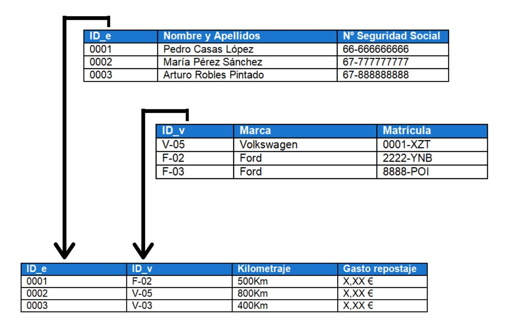
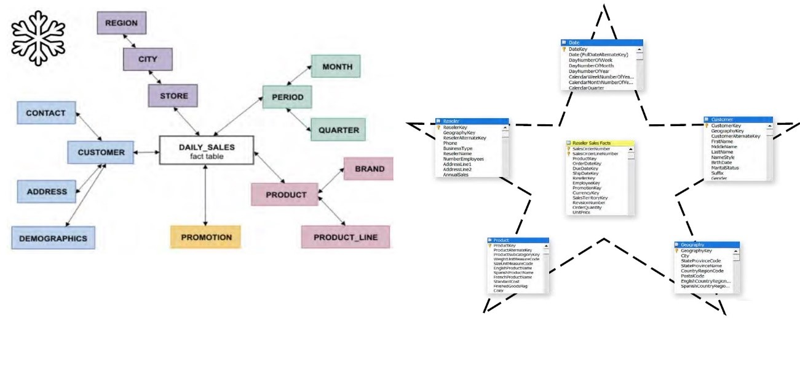

| **Inicio**               | **atrás 2**                           | **Siguiente 4**  |
| ------------------------ | ------------------------------------- | ---------------- |
| [🏠](../../../README.md) | [⏪](./2.PREPARACION_DE_LOS_DATOS.md) | [⏩](./4.DAX.md) |

---

## **Índice**

| Temario                                                                                                                      |
| ---------------------------------------------------------------------------------------------------------------------------- |
| [¿Qué es un modelo de datos?](#¿qué-es-un-modelo-de-datos)                                                                   |
| [Tipos de modelos (Estrella, Copo de Nieve – entorno Power BI)](#tipos-de-modelos-estrella-copo-de-nieve-–-entorno-power-bi) |
| [Tipo de relaciones](#tipo-de-relaciones)                                                                                    |
| [Dirección de filtro](#dirección-de-filtro)                                                                                  |
| [Importancia de la Tabla Calendario](#importancia-de-la-tabla-calendario)                                                    |
| [Creación de Jerarquías](#creación-de-jerarquías)                                                                            |
| [Categorización de campos](#categorización-de-campos)                                                                        |
| [Buenas prácticas de modelo de datos](#buenas-prácticas-de-modelo-de-datos)                                                  |

---

# **3. MODELADO DE DATOS**

---

## **¿Qué es un modelo de datos?**

Un modelo de datos es una representación estructurada y organizada de la información que se utiliza para comprender y analizar los datos de una organización. Proporciona una vista lógica de cómo se relacionan los datos entre sí y cómo se pueden consultar y analizar de manera efectiva.

En un modelo de datos, los datos se organizan en entidades (tablas) y las relaciones entre estas entidades se definen mediante claves primarias y claves externas. Estas relaciones permiten establecer conexiones y consultas entre las diferentes tablas para obtener información relevante.

Veamos un ejemplo para ilustrar esto. Supongamos que tienes una base de datos de una tienda en línea que contiene las siguientes entidades:

1. **Entidad "Productos":**

- **Columnas:** ID_Producto (clave primaria), Nombre, Precio, Categoría.

2. **Entidad "Clientes":**

- **Columnas:** ID_Cliente (clave primaria), Nombre, Dirección, Ciudad, País.

3. **Entidad "Pedidos":**

- **Columnas:** ID_Pedido (clave primaria), Fecha, ID_Cliente (clave externa), Total.

En este ejemplo, el modelo de datos consta de tres tablas (entidades) relacionadas entre sí. La entidad "Productos" contiene información sobre los productos disponibles en la tienda, la entidad "Clientes" almacena los datos de los clientes y la entidad "Pedidos" registra los pedidos realizados por los clientes.

La relación entre estas entidades se establece mediante las claves primarias y las claves externas. Por ejemplo, la columna "ID_Cliente" en la entidad "Pedidos" es una clave externa que hace referencia a la columna "ID_Cliente" en la entidad "Clientes". Esto indica que cada pedido está asociado a un cliente específico.

Un modelo de datos permite realizar consultas y análisis en base a estas relaciones. Por ejemplo, puedes obtener el nombre y la dirección de un cliente que realizó un pedido en una fecha determinada, o puedes calcular el total de ventas por categoría de productos.

En resumen, un modelo de datos proporciona una estructura lógica y organizada para representar y relacionar los datos de una organización. Permite realizar consultas complejas y análisis de manera eficiente y brinda una base sólida para la toma de decisiones informadas.

[🔼](#índice)

---

## **Tipos de modelos (Estrella, Copo de Nieve – entorno Power BI)**

En el entorno de Power BI, se utilizan principalmente dos tipos de modelos de datos: el modelo en estrella y el modelo copo de nieve. Ambos modelos son ampliamente utilizados en la creación de informes y análisis en Power BI y tienen características distintivas en cuanto a su estructura y organización.

1. **Modelo en Estrella:**

El modelo en estrella es una estructura de modelo de datos muy común y ampliamente utilizado en Power BI. En este modelo, una tabla central de hechos se conecta a varias tablas de dimensiones mediante relaciones unidireccionales. La tabla central de hechos contiene las métricas o medidas numéricas clave que se analizan, como ventas, ingresos, cantidades, etc. Las tablas de dimensiones contienen atributos descriptivos que proporcionan contexto a las medidas.

**Ejemplo:**

Supongamos que tienes una base de datos de ventas con las siguientes tablas:

- **Tabla de hechos "Ventas":**

**Columnas:** Fecha, ProductoID, ClienteID, Cantidad, Precio, etc.

- **Tabla de dimensiones "Productos":**

**Columnas:** ProductoID, Nombre, Categoría, etc.

- **Tabla de dimensiones "Clientes":**

**Columnas:** ClienteID, Nombre, Ciudad, País, etc.

En este ejemplo, la tabla de hechos "Ventas" actúa como la tabla central que se relaciona con las tablas de dimensiones "Productos" y "Clientes". Las relaciones unidireccionales se establecen entre las tablas para vincular las claves primarias y externas correspondientes. Esto permite realizar análisis y consultas sobre las ventas en función de los productos y clientes.

2. **Modelo Copo de Nieve:**

El modelo copo de nieve es una variante del modelo en estrella en la que las tablas de dimensiones se descomponen en tablas adicionales para normalizar la estructura. Esto significa que una tabla de dimensión puede dividirse en varias tablas más pequeñas para evitar la redundancia de datos. Estas tablas se conectan mediante relaciones para mantener la integridad de los datos.

**Ejemplo:**

Siguiendo el ejemplo anterior, en un modelo copo de nieve, la tabla de dimensiones "Productos" podría dividirse en dos tablas:

- **Tabla "Productos":**

**Columnas:** ProductoID, Nombre, etc.

**Tabla "Categorías":**

**Columnas:** CategoríaID, Nombre, etc.

En este caso, la tabla "Productos" actúa como una dimensión principal y la tabla "Categorías" se conecta a ella mediante una relación. Esto permite una estructura más normalizada y eficiente.

La elección entre un modelo en estrella y un modelo copo de nieve depende de los requisitos específicos del proyecto y la estructura de los datos. Ambos modelos tienen ventajas y desventajas, y la elección adecuada dependerá del contexto y los objetivos del análisis.

Es importante tener en cuenta que, independientemente del tipo de modelo utilizado, Power BI permite manejar y combinar múltiples fuentes de datos en un solo informe, lo que facilita el análisis y la visualización de datos desde diferentes perspectivas.

[🔼](#índice)

---

## **Tipo de relaciones**

En Power BI, existen tres tipos de relaciones que se pueden establecer entre las tablas de datos: relaciones uno a uno, relaciones uno a muchos y relaciones muchos a muchos. Cada tipo de relación tiene sus características y se utiliza en diferentes situaciones. A continuación, te explicaré en detalle cada uno de ellos:

1. **Relación Uno a Uno:**

En una relación uno a uno, cada fila de la tabla `A` se relaciona con una sola fila de la tabla `B`, y viceversa. Este tipo de relación es menos común que las relaciones uno a muchos, pero se utiliza cuando hay una relación directa y única entre las tablas.

**Ejemplo:**

Supongamos que tienes dos tablas: "Empleados" y "Direcciones". Cada empleado tiene una única dirección asignada, por lo que la relación entre las tablas es uno a uno. En este caso, la tabla "Empleados" tendría una columna "DirecciónID" que se relaciona con la tabla "Direcciones" a través de la columna "DirecciónID". Cada empleado tiene un único valor de "DirecciónID" que corresponde a una única fila en la tabla "Direcciones".

2. **Relación Uno a Muchos:**

En una relación uno a muchos, una fila de la tabla A se relaciona con varias filas de la tabla B, pero cada fila de la tabla B se relaciona con una sola fila de la tabla A. Este tipo de relación es el más común en Power BI y se utiliza cuando hay una relación de dependencia entre las tablas.

**Ejemplo:**

Tomemos el ejemplo de las tablas "Clientes" y "Pedidos". Cada cliente puede realizar múltiples pedidos, pero cada pedido está asociado a un único cliente. En este caso, la tabla "Clientes" tendría una columna "ClienteID" que se relaciona con la tabla "Pedidos" a través de la columna "ClienteID". Cada cliente puede tener varios pedidos, pero cada pedido está vinculado a un solo cliente.

3. **Relación Muchos a Muchos:**

En una relación muchos a muchos, varias filas de la tabla A se relacionan con varias filas de la tabla B, y viceversa. Este tipo de relación se utiliza cuando hay una asociación compleja entre las tablas y se necesita una tabla intermedia para establecer la relación.

**Ejemplo:**

Imagina que tienes dos tablas: "Estudiantes" y "Cursos". Un estudiante puede inscribirse en múltiples cursos, y un curso puede tener varios estudiantes matriculados. Para establecer una relación muchos a muchos, se crea una tercera tabla llamada "Inscripciones" que actúa como tabla intermedia. La tabla "Estudiantes" se relaciona con la tabla "Inscripciones" a través de una columna "EstudianteID", y la tabla "Cursos" se relaciona con la tabla "Inscripciones" a través de una columna "CursoID".

Las relaciones en Power BI son fundamentales para combinar y analizar datos de múltiples tablas. Al establecer las relaciones adecuadas entre las tablas, se pueden realizar análisis, filtros y agregaciones de datos de manera precisa y eficiente. Es importante comprender el tipo de relación requerida según la estructura de los datos y los objetivos del análisis para obtener resultados precisos y significativos.

[🔼](#índice)

---

## **Dirección de filtro**

La dirección de filtro en Power BI se refiere a la forma en que se aplica un filtro en una relación entre tablas. La dirección del filtro determina qué tabla filtra a la otra tabla en una relación uno a muchos. Hay dos direcciones de filtro: dirección de filtro única y dirección de filtro cruzada.

1. **Dirección de filtro única:**

En la dirección de filtro única, el filtro se aplica desde la tabla "uno" hacia la tabla "muchos". Esto significa que los filtros aplicados en la tabla "uno" se propagan a la tabla "muchos". En otras palabras, la tabla "uno" actúa como origen del filtro y limita los resultados en la tabla "muchos".

**Ejemplo:**

Supongamos que tienes dos tablas: "Categorías" y "Productos". La tabla "Categorías" tiene una columna "CategoríaID" y la tabla "Productos" tiene una columna "CategoríaID" que establece la relación entre las tablas. Si aplicas un filtro en la tabla "Categorías" para mostrar solo las categorías con "CategoríaID" igual a 1, la dirección de filtro única asegurará que solo los productos asociados a esa categoría se muestren en la tabla "Productos".

2. **Dirección de filtro cruzada:**

En la dirección de filtro cruzada, el filtro se aplica desde la tabla "muchos" hacia la tabla "uno". Esto significa que los filtros aplicados en la tabla "muchos" se propagan a la tabla "uno". En otras palabras, la tabla "muchos" actúa como origen del filtro y limita los resultados en la tabla "uno".

**Ejemplo:**

Continuando con el ejemplo anterior de las tablas "Categorías" y "Productos", si aplicas un filtro en la tabla "Productos" para mostrar solo los productos con un precio mayor a $50, la dirección de filtro cruzada asegurará que solo las categorías que contengan productos con ese criterio de precio se muestren en la tabla "Categorías".

En resumen, la dirección de filtro en Power BI determina la forma en que se aplican los filtros entre tablas relacionadas. La elección de la dirección de filtro depende del contexto y los resultados deseados en el análisis de los datos. Es importante comprender cómo funciona la dirección de filtro para garantizar resultados precisos y coherentes en los informes y visualizaciones.

[🔼](#índice)

---

## **Importancia de la Tabla Calendario**

La tabla de calendario es una tabla especial utilizada en el modelado de datos para representar fechas y proporcionar información adicional sobre ellas. Esta tabla es especialmente útil en el contexto de análisis de datos y Business Intelligence, ya que permite realizar análisis de series temporales, comparaciones entre períodos y seguimiento de tendencias.

A continuación, se explican algunos aspectos importantes sobre la tabla de calendario y su importancia en el análisis de datos:

1. **Representación de fechas:** La tabla de calendario contiene una columna que representa las fechas en un rango específico, como días, meses o años. Esta columna permite realizar operaciones y cálculos basados en fechas, como identificar el día de la semana, el trimestre o el año fiscal al que pertenece una fecha determinada.

2. **Inclusión de información adicional:** Además de las fechas, la tabla de calendario puede incluir columnas adicionales que brinden información útil para el análisis. Algunos ejemplos de información adicional son: el nombre del mes, el número de semana, días festivos, días laborables, estaciones del año, entre otros. Estos datos adicionales facilitan la segmentación y el agrupamiento de datos en función de diferentes criterios temporales.

3. **Análisis de series temporales:** La tabla de calendario permite realizar análisis de series temporales, que consisten en examinar el comportamiento de los datos a lo largo del tiempo. Esto incluye identificar patrones, tendencias y estacionalidad en los datos. Al vincular los datos con la tabla de calendario, es posible realizar comparaciones entre diferentes períodos y evaluar el rendimiento en función de la evolución temporal.

4. **Filtrado y segmentación temporal:** La tabla de calendario también es útil para filtrar y segmentar los datos en función de diferentes intervalos de tiempo. Por ejemplo, es posible filtrar los datos para mostrar solo un mes específico, un trimestre o un año determinado. Esto permite obtener una visión más detallada o resumida de los datos según las necesidades de análisis.

5. **Generación de medidas acumuladas:** Con la tabla de calendario, es posible generar medidas acumuladas, como sumas acumulativas o promedios acumulados, que brindan información sobre el rendimiento acumulado en un período dado. Esto puede ser útil para evaluar el progreso en el logro de objetivos a lo largo del tiempo.

En resumen, la tabla de calendario es un componente fundamental en el modelado de datos para análisis de series temporales y seguimiento del rendimiento en función del tiempo. Proporciona una estructura temporal coherente y permite realizar cálculos y comparaciones precisas. Al aprovechar la información adicional y las funcionalidades que ofrece, se puede obtener una visión más completa y profunda de los datos y realizar análisis más avanzados en el contexto del tiempo.

[🔼](#índice)

---

## **Creación de Jerarquías**

La creación de jerarquías es una técnica utilizada en el modelado de datos para organizar y estructurar dimensiones en niveles jerárquicos. Una jerarquía representa una relación de subordinación entre elementos, donde cada nivel se subdivide en subniveles más detallados. Esto permite una navegación más intuitiva y un análisis más profundo de los datos.

A continuación, se explica cómo se puede crear una jerarquía en un modelo de datos, utilizando un ejemplo con una dimensión de tiempo:

1. **Identificar los niveles jerárquicos:** En primer lugar, se deben identificar los diferentes niveles jerárquicos en la dimensión. Por ejemplo, en la dimensión de tiempo, los niveles pueden ser año, trimestre, mes y día.

2. **Crear columnas para cada nivel:** Para cada nivel identificado, se deben crear columnas en la tabla de la dimensión que representen ese nivel. Por ejemplo, se pueden crear columnas llamadas "Año", "Trimestre", "Mes" y "Día".

3. **Definir las relaciones entre los niveles:** A continuación, se deben establecer las relaciones entre los diferentes niveles de la jerarquía. Por lo general, esto se logra estableciendo relaciones de uno a muchos entre las columnas de nivel superior y las columnas de nivel inferior. Por ejemplo, la columna "Año" estaría relacionada con la columna "Trimestre" a través de una relación de uno a muchos, y la columna "Trimestre" estaría relacionada con la columna "Mes".

4. **Organizar los niveles en una jerarquía:** Una vez que se han creado las columnas y establecido las relaciones, se puede crear una jerarquía que organice los niveles en orden jerárquico. Esto se puede hacer en la herramienta de modelado de datos, como Power BI, arrastrando y soltando los niveles en la jerarquía.

5. **Personalizar el nombre y las propiedades de la jerarquía:** Es posible personalizar el nombre de la jerarquía y las propiedades asociadas, como la agrupación y el orden de los elementos. Por ejemplo, se puede renombrar la jerarquía como "Jerarquía de tiempo" y establecer que los elementos se muestren en orden descendente según el año.

6. **Utilizar la jerarquía en análisis y visualizaciones:** Una vez creada la jerarquía, se puede utilizar en análisis y visualizaciones para explorar los datos de manera más intuitiva. Por ejemplo, se puede expandir o contraer los niveles de la jerarquía para enfocarse en diferentes niveles de detalle, realizar análisis comparativos entre diferentes períodos o utilizar la jerarquía como eje en un gráfico de líneas o barras.

La creación de jerarquías en un modelo de datos facilita la navegación y el análisis de los datos, ya que permite una estructura organizada y jerárquica. Además, proporciona una mayor flexibilidad y capacidad de análisis, ya que se pueden utilizar diferentes niveles de detalle en función de las necesidades del análisis.

[🔼](#índice)

---

## **Categorización de campos**

La categorización de campos en Power BI es una práctica común que consiste en asignar categorías específicas a los campos de datos para facilitar su uso y comprensión en la creación de informes y visualizaciones. Al categorizar los campos, se les asigna un propósito y un comportamiento predefinido dentro de Power BI.

A continuación, se detalla el proceso de categorización de campos en Power BI, junto con ejemplos:

1. **Categorías de campos predefinidas:** Power BI proporciona una serie de categorías predefinidas que se pueden asignar a los campos. Algunas de las categorías comunes son las siguientes:

- **Texto:** Se utiliza para campos que contienen texto o cadenas de caracteres, como nombres, descripciones o categorías.
- **Número entero:** Se utiliza para campos que contienen valores enteros, como números de identificación o conteos.
- **Número decimal:** Se utiliza para campos que contienen valores decimales, como montos o porcentajes.
- **Fecha/hora:** Se utiliza para campos que contienen valores de fecha o tiempo.
- **Geografía:** Se utiliza para campos que contienen información de ubicación geográfica, como direcciones o coordenadas.

2. **Asignación de categorías a los campos:** Para asignar una categoría a un campo en Power BI, se deben seguir estos pasos:

- Abre el archivo de Power BI Desktop y selecciona el campo que deseas categorizar.
- En la pestaña "Modelo" de la cinta de opciones, en el grupo "Propiedades", encontrarás la opción "Categoría de datos".
- Haz clic en la lista desplegable y elige la categoría adecuada para el campo seleccionado.

3. **Uso de categorías en visualizaciones y análisis:** Una vez que los campos están categorizados, se pueden utilizar en visualizaciones y análisis de manera más efectiva. Power BI reconocerá automáticamente la categoría asignada a un campo y proporcionará opciones y comportamientos predefinidos basados en esa categoría. Por ejemplo:

- Para campos de fecha, se pueden utilizar funciones y opciones de filtrado específicas para fechas, como resumen por año o filtrado por rango de fechas.
- Para campos numéricos, se pueden aplicar funciones de agregación, como suma o promedio, en visualizaciones.
- Para campos de geografía, se pueden utilizar visualizaciones basadas en mapas para mostrar datos relacionados con ubicaciones geográficas.

Es importante tener en cuenta que la categorización de campos en Power BI no afecta la naturaleza real de los datos. Simplemente ayuda a Power BI a interpretar y tratar los campos de manera adecuada en función de su categoría.

En resumen, la categorización de campos en Power BI facilita la selección y el uso de campos en informes y visualizaciones, al proporcionar categorías predefinidas que determinan el comportamiento y las opciones disponibles para cada campo. Esto ayuda a mejorar la precisión y la calidad de los análisis y las visualizaciones en Power BI.

[🔼](#índice)

---

## **Buenas prácticas de modelo de datos**

Las buenas prácticas de modelo de datos en Power BI se refieren a las recomendaciones y pautas para diseñar un modelo de datos eficiente, escalable y fácil de usar. Un buen modelo de datos facilita la creación de informes y visualizaciones, mejora el rendimiento de las consultas y proporciona una experiencia de usuario fluida. A continuación, se presentan algunas buenas prácticas para el modelo de datos en Power BI:

1. **Normalización de datos:** La normalización implica organizar los datos en estructuras relacionales para reducir la redundancia y mejorar la integridad de los datos. Se recomienda descomponer las tablas en entidades más pequeñas y relacionarlas mediante claves primarias y foráneas. Esto garantiza la consistencia de los datos y evita la duplicación innecesaria.

2. **Uso adecuado de las relaciones:** Es fundamental establecer relaciones correctas entre las tablas del modelo de datos. Las relaciones deben basarse en claves primarias y foráneas y seguir la lógica del negocio. Además, se recomienda definir correctamente la dirección de las relaciones y establecer relaciones activas/inactivas según sea necesario.

3. **Uso de jerarquías:** Las jerarquías son útiles para organizar los datos en niveles lógicos, lo que facilita la navegación y el análisis de los datos. Se deben crear jerarquías en los campos que tienen una estructura de nivel, como año, trimestre, mes, etc. Esto permite realizar análisis en diferentes niveles de detalle y realizar perforaciones en los datos.

4. **Uso de tablas de hechos y dimensiones:** Se recomienda utilizar una arquitectura de modelo de datos en estrella o copo de nieve, donde las tablas de hechos contienen medidas numéricas y las dimensiones contienen atributos descriptivos. Esta estructura facilita la agregación y el análisis de datos y proporciona un rendimiento óptimo en las consultas.

5. **Uso de nombres descriptivos y coherentes:** Es importante utilizar nombres claros y descriptivos para las tablas y los campos en el modelo de datos. Esto facilita la comprensión de la estructura del modelo y mejora la legibilidad de las fórmulas y las visualizaciones. Además, se debe mantener una convención de nomenclatura coherente en todo el modelo para evitar confusiones.

6. **Carga eficiente de datos:** Es recomendable optimizar la carga de datos en Power BI mediante técnicas como la carga incremental o la extracción selectiva de datos. Esto ayuda a reducir los tiempos de carga y mejorar el rendimiento del modelo. Además, se deben establecer horarios de actualización adecuados para mantener los datos actualizados.

7. **Uso de medidas calculadas y columnas calculadas:** Las medidas calculadas y las columnas calculadas permiten realizar cálculos y transformaciones adicionales en los datos. Se recomienda utilizar medidas calculadas para realizar cálculos agregados y utilizar columnas calculadas para realizar transformaciones en los datos antes de la agregación. Esto mejora la flexibilidad y el rendimiento del modelo.

8. **Organización de carpetas y etiquetas:** A medida que el modelo de datos crece, es importante organizar las tablas, las medidas y las visualizaciones en carpetas lógicas y asignar etiquetas adecuadas. Esto facilita la navegación y la búsqueda de objetos en el modelo y mejora la mantenibilidad.

Estas son algunas de las buenas prácticas para el modelo de datos en Power BI. Siguiendo estas recomendaciones, se puede lograr un modelo de datos eficiente y fácil de usar, que brinde una base sólida para la creación de informes y visualizaciones en Power BI.

[🔼](#índice)

---

| **Inicio**               | **atrás 1**                          | **Siguiente 4**  |
| ------------------------ | ------------------------------------ | ---------------- |
| [🏠](../../../README.md) | [⏪](./1.INTRODUCCION_A_POWER_BI.md) | [⏩](./4.DAX.md) |
