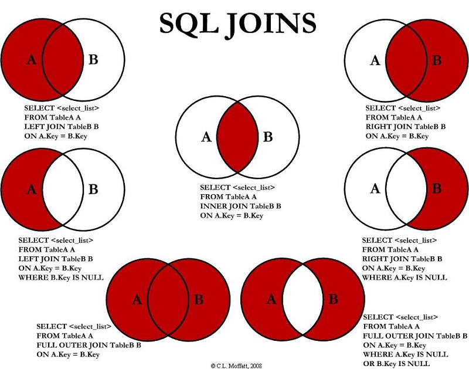

| **Inicio**            | **atrás 7**                | **Siguiente 9**             |
| --------------------- | -------------------------- | --------------------------- |
| [🏠](../../README.md) | [⏪](./7_consulta_JOIN.md) | [⏩](./9_consultas_NULL.md) |

---

# **Lección SQL 7: Uniones Externas**

Dependiendo de cómo desee analizar los datos, la **INNER JOIN** lección que utilizamos la última lección podría no ser suficiente porque la tabla resultante solo contiene datos que pertenecen a ambas tablas.

Si las dos tablas tienen datos asimétricos, lo que puede suceder fácilemente cuando los datos se ingresan en diferentes etapas, entonces tendríamos que usar un **LEFT JOIN** en su lugar para asegurarnos de que los datos que necesita no queden fuera de los resultados. **RIGHT JOIN**, **FULL JOIN**.

```
SELECT column, another_column, …
FROM mytable
INNER/LEFT/RIGHT/FULL JOIN another_table
    ON mytable.id = another_table.matching_id
WHERE condition(s)
ORDER BY column, … ASC/DESC
LIMIT num_limit OFFSET num_offset;
```

Al igual que **INNER JOIN** estas tres nuevas uniones, deben especificar en qué columna unir los datos.

Al unir la tabla A con la tabla B, **LEFT JOIN** simplemente incluye filas de A independientemente de si se encuentra una fila coincidente en B. Es **RIGHT JOIN** lo mismo, pero al revés, manteniendo las filas en B independientemente de si se encuentra una coincidencia en A. Finalmente, a **FULL JOIN** simplemente significa que las filas de ambas tablas se mantienen, independientemente de si existe una fila coincidente en la otra tabla.

Cuando utilice cualquier de estas nievas uniones, probablemente tendrá que escribir lógica adicional para tratar con **NULL** en el resultado y las restricciones (más sobre esto en la próxima lección).



> ¿Sabías?
>
> Es posib le que vea consultas con estas combinaciones escritas como **LEFT OUTER JOIN**, **RIGHT OUTER JOIN** o **FULL OUTER JOIN**, pero la **OUTER** palabra clave realmente se mantiene para compatibilidad con SQL-92 y estas consultas son simplemente equivalentes a **LEFT JOIN**, **RIGHT JOIN** y **FULL JOIN** respectivamente.

**Ejercicio**

En este ejercicio, trabajará con una nueva tabla que almacena datos ficticios sobre los empleados en el estudio de cine y sus edificios de oficinas asignados. Algunos de los edificios son nuevos, por lo que aún no tienen empleados, pero de todos modos necesitamos encontrar información sobre ellos.

Dado que la base de datos SQL de nuestro navegador es algo limitada, **LEFT JOIN** en el siguiente ejercicio solo se admite.

**Table: Buildings**

| **Building_name** | **Capacity** |
| ----------------- | ------------ |
| 1e                | 24           |
| 1w                | 32           |
| 2e                | 16           |
| 2w                | 20           |

**Table: Employees**

| **Role** | **Name**   | **Building** | **Years_employed** |
| -------- | ---------- | ------------ | ------------------ |
| Engineer | Becky A.   | 1e           | 4                  |
| Engineer | Dan B.     | 1e           | 2                  |
| Engineer | Sharon F.  | 1e           | 6                  |
| Engineer | Dan M.     | 1e           | 4                  |
| Engineer | Malcom S.  | 1e           | 1                  |
| Artist   | Tylar S.   | 2w           | 2                  |
| Artist   | Sherman D. | 2w           | 8                  |
| Artist   | Jakob J.   | 2w           | 6                  |
| Artist   | Lillia A.  | 2w           | 7                  |
| Artist   | Brandon J. | 2w           | 7                  |
| Manager  | Scott K.   | 1e           | 9                  |
| Manager  | Shirlee M. | 1e           | 3                  |
| Manager  | Daria O.   | 2w           | 6                  |

**Ejercicio 7: Tareas**

- **Encuentre la lista de todos los edificios que tienen empleados.**

```
SELECT DISTINCT building FROM employees;
```

- **Encuentra la lista de todos los edificios y su capacidad.**

```
SELECT * FROM buildings;
```

- **Enumere todos los edificios y las distintas funciones de los empleados en cada edificio (incluidos los edificios vacíos)**

```
SELECT DISTINCT building_name, role
FROM buildings
  LEFT JOIN employees
    ON building_name = building;
```

| **Inicio**            | **atrás 7**                | **Siguiente 9**             |
| --------------------- | -------------------------- | --------------------------- |
| [🏠](../../README.md) | [⏪](./7_consulta_JOIN.md) | [⏩](./9_consultas_NULL.md) |

---
